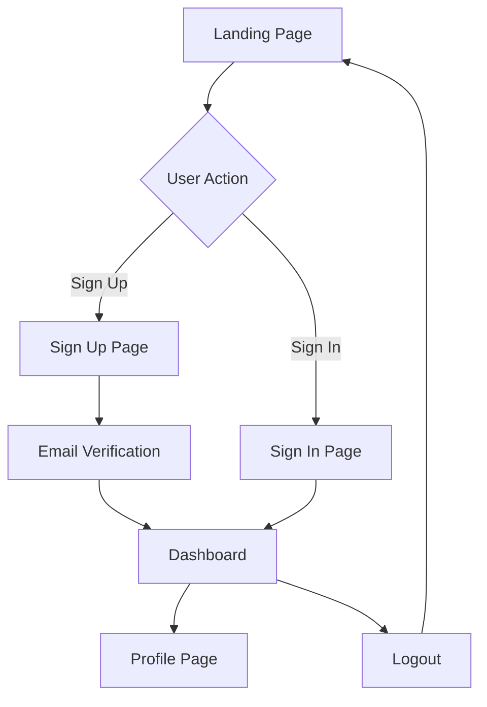

## 1. Product Overview
Analytics Challenge is a web application designed to provide users with analytics capabilities through a modern, responsive interface. The platform enables users to authenticate, access analytics dashboards, and manage their account settings.

The main purpose is to solve the need for accessible analytics tools with a focus on user experience and modern web technologies. Target users include data analysts, business professionals, and anyone needing analytics insights through an intuitive web interface.

## 2. Core Features

### 2.1 User Roles
| Role | Registration Method | Core Permissions |
|------|---------------------|------------------|
| User | Email registration via Supabase | Access to analytics dashboard, profile management, data visualization |
| Admin | Manual assignment | Full access to user management, system settings, analytics configuration |

### 2.2 Feature Module
The analytics-challenge application consists of the following main pages:
1. **Landing page**: Hero section, navigation, feature overview, call-to-action buttons
2. **Sign up page**: User registration form, email verification, password requirements
3. **Sign in page**: User authentication, password recovery, remember me functionality
4. **Dashboard page**: Analytics overview, data visualization, quick stats
5. **Profile page**: User settings, account management, preferences

### 2.3 Page Details
| Page Name | Module Name | Feature description |
|-----------|-------------|---------------------|
| Landing page | Hero section | Display compelling headline, brief description of analytics capabilities, and primary call-to-action button |
| Landing page | Navigation | Responsive navigation bar with brand logo, menu items, and sign in/up buttons |
| Landing page | Feature overview | Showcase key analytics features with icons and descriptions |
| Sign up page | Registration form | Collect user email, password, and confirm password with validation |
| Sign up page | Email verification | Send verification email after successful registration |
| Sign in page | Authentication form | Email and password login with error handling |
| Sign in page | Password recovery | Link to reset password via email |
| Sign in page | Remember me | Optional checkbox to persist login session |
| Dashboard page | Analytics overview | Display key metrics and KPIs in card format |
| Dashboard page | Data visualization | Interactive charts and graphs using modern charting libraries |
| Dashboard page | Quick stats | Summary statistics with trend indicators |
| Profile page | User settings | Edit display name, email preferences, and account details |
| Profile page | Account management | View account status, change password, delete account option |

## 3. Core Process
**User Registration Flow**: User visits landing page → Clicks sign up → Fills registration form → Receives verification email → Confirms email → Redirected to dashboard

**User Authentication Flow**: User visits sign in page → Enters credentials → System validates with Supabase → Redirected to dashboard on success → Session persisted if "remember me" selected

**Dashboard Access Flow**: Authenticated user accesses dashboard → System loads user-specific analytics data → Displays personalized dashboard with relevant metrics

## 4. User Interface Design

### 4.1 Design Style
- **Primary colors**: Deep blue (#1e40af) for primary actions, white (#ffffff) for backgrounds
- **Secondary colors**: Light gray (#f3f4f6) for cards, green (#10b981) for success states
- **Button style**: Rounded corners with subtle shadows, primary buttons filled, secondary outlined
- **Font**: Inter font family with clear hierarchy (16px base, 14px small, 18px large)
- **Layout style**: Card-based design with consistent spacing, top navigation bar
- **Icons**: Lucide React icons for consistency and modern appearance

### 4.2 Page Design Overview
| Page Name | Module Name | UI Elements |
|-----------|-------------|-------------|
| Landing page | Hero section | Full-width hero with gradient background, centered headline text, prominent CTA button with hover effects |
| Landing page | Navigation | Sticky top navigation with brand logo left, menu items center, auth buttons right, mobile hamburger menu |
| Sign up page | Registration form | Centered card layout with form inputs, password strength indicator, submit button with loading state |
| Sign in page | Authentication form | Similar card layout to sign up, includes "Remember me" checkbox, links to sign up and password reset |
| Dashboard page | Analytics overview | Grid layout of metric cards with icons, numbers, and trend arrows, responsive columns |
| Dashboard page | Data visualization | Responsive chart containers with proper aspect ratios, interactive tooltips, legend positioning |
| Profile page | User settings | Form layout with labeled inputs, save button with confirmation, section dividers |

### 4.3 Responsiveness
The application follows a desktop-first design approach with mobile responsiveness:
- Desktop: Full navigation bar, multi-column layouts, expanded charts
- Tablet: Collapsible navigation, adjusted grid layouts, touch-friendly interactions
- Mobile: Hamburger menu, single-column layouts, stacked cards, optimized touch targets

### 4.4 Accessibility
- WCAG 2.1 AA compliance for color contrast
- Keyboard navigation support throughout the application
- Screen reader compatibility with proper ARIA labels
- Focus indicators for all interactive elements