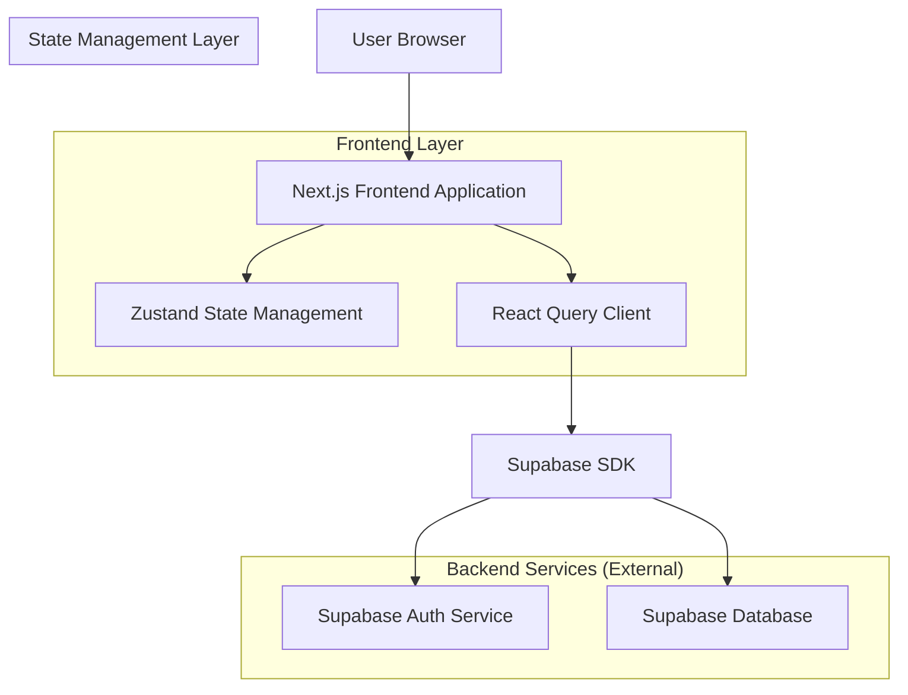
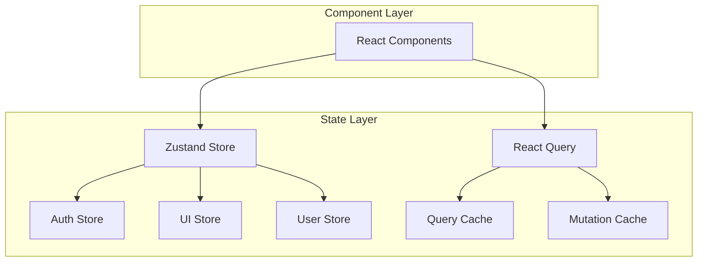
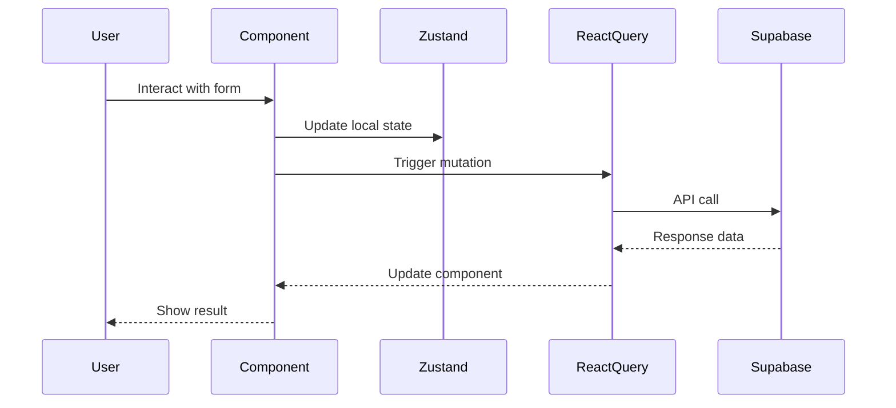

## 1. Architecture design



## 2. Technology Description

- **Frontend**: Next.js@14 + React@18 + TypeScript@5
- **Styling**: Tailwind CSS@3 + shadcn/ui
- **State Management**: Zustand@4
- **Data Fetching**: React Query@5 (TanStack Query)
- **Authentication**: Supabase Auth
- **Database**: Supabase PostgreSQL (via separate backend project)
- **Initialization Tool**: create-next-app

## 3. Route definitions

| Route | Purpose |
|-------|---------|
| / | Landing page with hero section and feature overview |
| /auth/signup | User registration page with email verification |
| /auth/signin | User authentication page with login form |
| /dashboard | Main analytics dashboard with data visualizations |
| /profile | User profile and account settings page |
| /auth/callback | Supabase authentication callback handler |

## 4. API definitions

### 4.1 Authentication API

**User Registration**
```
POST /auth/v1/signup
```

Request:
| Param Name | Param Type | isRequired | Description |
|------------|------------|------------|-------------|
| email | string | true | User email address |
| password | string | true | User password (min 6 characters) |

Response:
| Param Name | Param Type | Description |
|------------|-------------|-------------|
| user | object | User object with id, email, created_at |
| session | object | Session token for immediate login |

Example:
```json
{
  "email": "user@example.com",
  "password": "securepassword123"
}
```

**User Login**
```
POST /auth/v1/token?grant_type=password
```

Request:
| Param Name | Param Type | isRequired | Description |
|------------|------------|------------|-------------|
| email | string | true | User email address |
| password | string | true | User password |

Response:
| Param Name | Param Type | Description |
|------------|-------------|-------------|
| access_token | string | JWT access token |
| refresh_token | string | Refresh token for session renewal |
| user | object | User object with profile data |

### 4.2 User Session Management

**Get Current User**
```
GET /auth/v1/user
```

Headers:
| Header Name | Value |
|-------------|--------|
| Authorization | Bearer {access_token} |

Response:
| Param Name | Param Type | Description |
|------------|-------------|-------------|
| id | string | User UUID |
| email | string | User email address |
| created_at | string | Account creation timestamp |

**Sign Out**
```
POST /auth/v1/logout
```

Headers:
| Header Name | Value |
|-------------|--------|
| Authorization | Bearer {access_token} |

## 5. State Management Architecture



## 6. Component Architecture

### 6.1 Core Components Structure

**Authentication Components**
- `AuthProvider`: Context provider for authentication state
- `SignUpForm`: Registration form with validation
- `SignInForm`: Login form with error handling
- `ProtectedRoute`: Route guard for authenticated pages

**UI Components (shadcn/ui)**
- `Button`: Primary/secondary buttons with variants
- `Card`: Container for dashboard metrics
- `Input`: Form inputs with validation states
- `Navigation`: Responsive navigation bar
- `Toast`: Notification system for user feedback

**Dashboard Components**
- `MetricCard`: Individual metric display component
- `ChartContainer`: Responsive chart wrapper
- `DataTable`: Tabular data display with sorting

### 6.2 Data Flow



## 7. Environment Configuration

**Required Environment Variables**
```env
NEXT_PUBLIC_SUPABASE_URL=your_supabase_project_url
NEXT_PUBLIC_SUPABASE_ANON_KEY=your_supabase_anon_key
SUPABASE_SERVICE_ROLE_KEY=your_service_role_key
```

**Development Setup**
- TypeScript strict mode enabled
- ESLint and Prettier configured
- Hot reload for development
- Automatic API route generation

## 8. Security Considerations

- JWT tokens stored in httpOnly cookies (when possible)
- CSRF protection on all forms
- Input validation on client and server
- Rate limiting on authentication endpoints
- Secure headers configuration
- Environment variable validation at build time